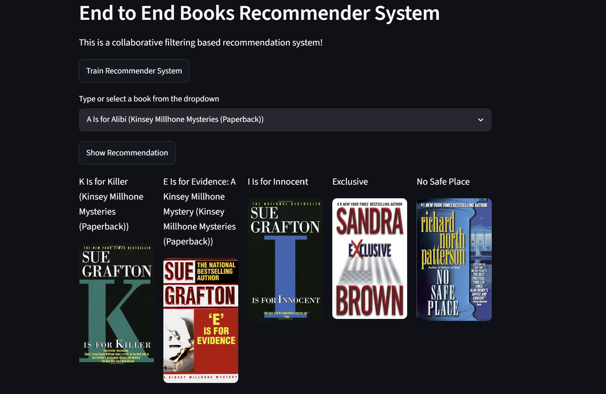

# 📚 End-to-End Books Recommender System

[]()
[]()
[]()
[]()
[](https://end-to-end-book-recommendation-system-ovog.onrender.com/)

A complete **Collaborative Filtering-based Book Recommendation System** built using **Python**, **Machine Learning**, and **Streamlit**. The application recommends books similar to the one selected by the user and displays their cover images through an interactive web interface.

## 🌐 Live Demo

🔗 **Live Application:**  
https://end-to-end-book-recommendation-system-ovog.onrender.com/

---

## 🚀 Features

- 📖 Collaborative Filtering recommendation engine
- 🔍 Search or select a book from a dropdown
- 🤖 Train the recommendation model with a single click
- 📚 Display Top-5 similar book recommendations
- 🖼️ Book cover image previews
- ⚡ Fast and interactive Streamlit UI
- ☁️ Deployed on Render

---

## 🛠️ Tech Stack

- Python 3.10
- Pandas
- NumPy
- Scikit-learn
- Streamlit
- Pickle
- YAML

---

# 🖥️ Application Screenshot

> Save the screenshot below in your repository as **`screenshot.png`**.

<p align="center">
    
</p>

---

# 📂 Project Structure

```text
End-to-end-Book-Recommendation-System/
│
├── artifacts/
│
├── components/
│
├── config/
│   └── configuration.py
│
├── entity/
│
├── pipeline/
│
├── utils/
│
├── config.yaml
│
├── app.py
│
├── main.py
│
├── requirements.txt
│
├── screenshot.png
│
├── README.md
│
└── .gitignore
```

---

# ⚙️ Project Workflow

```text
config.yaml
      │
      ▼
Configuration Manager
      │
      ▼
Entity
      │
      ▼
Components
      │
      ▼
Training Pipeline
      │
      ▼
Recommendation Model
      │
      ▼
Prediction Pipeline
      │
      ▼
Streamlit Web Application
```

---

# 🚀 Getting Started

## 1. Clone the Repository

```bash
git clone https://github.com/ankittripathy12/End-to-end-Book-Recommendation-System.git
```

```bash
cd End-to-end-Book-Recommendation-System
```

---

## 2. Create a Conda Environment

```bash
conda create -n books python=3.10 -y
```

Activate the environment

```bash
conda activate books
```

---

## 3. Install Dependencies

```bash
pip install -r requirements.txt
```

---

## 4. Train the Recommendation Model

```bash
python main.py
```

---

## 5. Run the Streamlit Application

```bash
streamlit run app.py
```

Visit

```
http://localhost:8501
```

---

# ☁️ Deployment

The application is deployed on **Render**.

**Live URL**

https://end-to-end-book-recommendation-system-ovog.onrender.com/

---

# 📖 How It Works

1. Load and preprocess the book dataset.
2. Create a User-Book interaction matrix.
3. Train the collaborative filtering recommendation model.
4. Save the trained model.
5. User selects a book from the dropdown.
6. Similar books are retrieved using the trained model.
7. Recommended books and their cover images are displayed.

---

# ✨ Future Improvements

- User Authentication
- Personalized Recommendations
- Hybrid Recommendation System
- Content-Based Filtering
- Book Search API
- User Ratings and Reviews
- Recommendation History
- REST API Integration

---

# 🤝 Contributing

Contributions are always welcome!

1. Fork the repository.

2. Create a new branch.

```bash
git checkout -b feature-name
```

3. Commit your changes.

```bash
git commit -m "Added new feature"
```

4. Push to your branch.

```bash
git push origin feature-name
```

5. Open a Pull Request.

---

# ⭐ Support

If you like this project, don't forget to give it a ⭐ on GitHub!

---

# 👨‍💻 Author

### Ankit Kumar Tripathy

**GitHub**

https://github.com/ankittripathy12

**LinkedIn**

https://www.linkedin.com/in/ankit-kumar-tripathy

---

# 📜 License

This project is licensed under the **MIT License**.

---

# 🙏 Acknowledgements

Special thanks to the open-source community and the libraries that made this project possible.

- Streamlit
- Scikit-learn
- Pandas
- NumPy
- Python

---

## 🌟 If you found this project useful, please consider giving it a star ⭐ on GitHub!